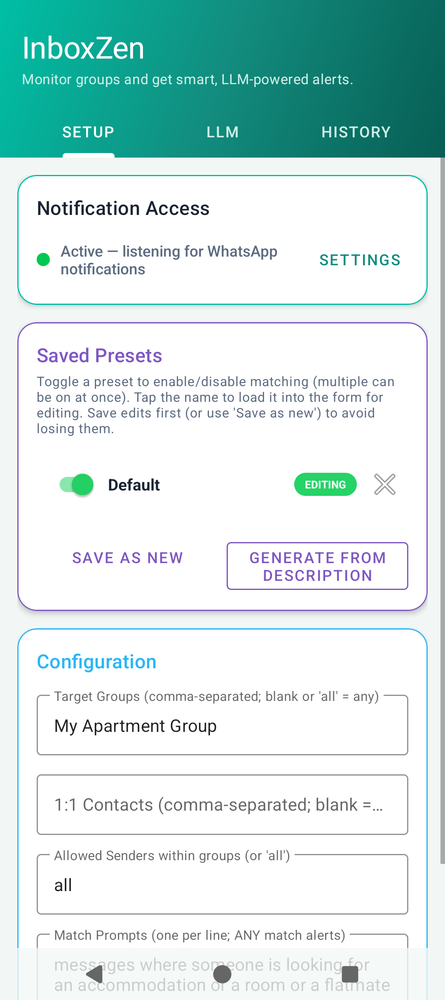
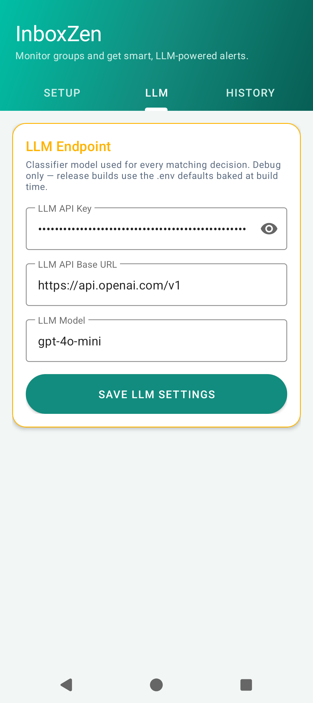
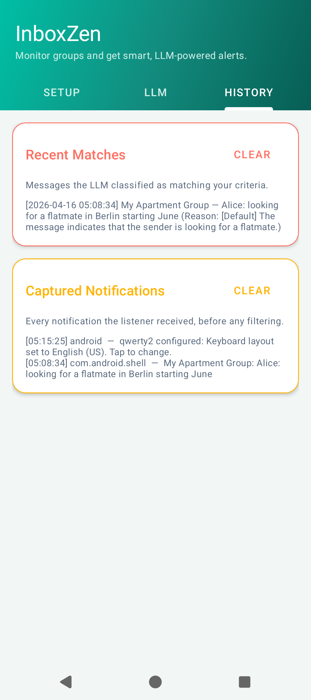
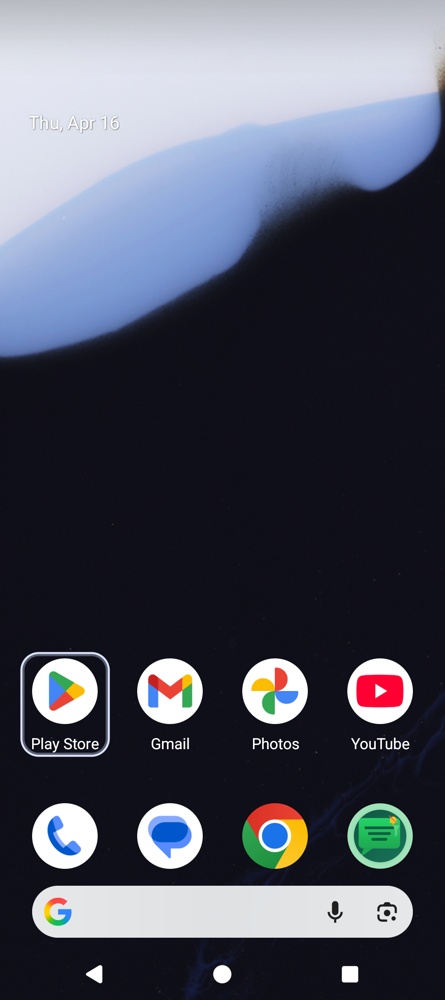

# InboxZen

An Android app that listens for WhatsApp notifications, filters them
through named, reusable **presets**, and uses an LLM (any OpenAI-compatible
chat-completions endpoint) to classify whether each message actually
matches your criteria. Matching messages trigger a high-priority alert on
your phone.

Typical use: monitor one or more busy WhatsApp groups — or specific 1:1
contacts — for messages on a specific topic (flatmate search, on-call
outages, job postings) without reading every message yourself.

---

## Screenshots

The three tabs in a debug build. Release builds show only the first.

| Setup | LLM (debug) | History (debug) |
|-------|---|---|
|  |  |  |

The **History** tab above shows Recent Matches — the messages the LLM
approved, each tagged with the preset name that triggered it (e.g.
`[Default]`). Captured Notifications underneath is the raw unfiltered
feed.

App icon on the launcher:



---

## How it works

```
WhatsApp notification
        │
        ▼
WhatsAppNotificationListener      parse (title / text / bigText / subText /
        │                          EXTRA_MESSAGES / MessagingStyle extras),
        │                          strip "(N messages)" bundle-count suffix
        ▼
CapturedNotifications             raw feed — debug only
        │
        ▼
for each enabled preset:
   MessageMatcher                 target_groups / target_individuals /
        │                          allowed_senders
        ▼
   LlmMatcher                    send (match prompts + message) to an LLM,
        │                         parse {"matches": bool, "matched_criterion": N,
        │                                "reason": string}
        ▼
   AlertNotifier                 post a high-priority system notification;
                                  (debug only) also write to MatchHistory
```

Alerts are posted from the first enabled preset whose filters + LLM
approve the message. Multiple presets can be enabled simultaneously; the
listener iterates them in order and short-circuits on the first match.

---

## Features

- **Named presets** — save multiple matching profiles (e.g. *Flatmate
  alerts*, *On-call outages*, *Job postings*). Each preset bundles target
  groups, 1:1 contacts, sender allow-list, and one or more match prompts.
- **Independent enable/disable** — toggle any preset on/off without
  deleting it. Multiple presets can be enabled at once.
- **Natural-language generation** — type *"alert me when Alice or Bob in
  Flatmates mention rent or subletting"* and the LLM fills the form.
- **Multiple target groups, contacts, prompts** per preset — any-match
  semantics.
- **Bundled-notification handling** — WhatsApp titles like `"You n Me (2
  messages)"` are normalized so the group filter doesn't silently drop
  them.
- **LLM-agnostic** — any OpenAI-compatible `/chat/completions` endpoint
  works (OpenAI, Together, Groq, local proxies).
- **Debug-only diagnostics** — Captured Notifications (raw feed), Recent
  Matches (LLM-approved), and LLM-endpoint tabs are only present in the
  debug APK; release builds show just the Setup tab and bake the LLM
  config from `.env`.

---

## Project layout

```
.
├── app/
│   └── src/
│       ├── main/
│       │   ├── AndroidManifest.xml
│       │   ├── java/com/notifier/whatsapp/
│       │   │   ├── AlertNotifier.kt            # posts match-alert notifications
│       │   │   ├── AppConfig.kt                # runtime config surface; routes to PresetStore
│       │   │   ├── CapturedNotifications.kt    # debug feed of every received notification
│       │   │   ├── ConfigGenerator.kt          # natural-language → structured config (LLM)
│       │   │   ├── ConfigPreset.kt             # data class; enabled flag + parsing helpers
│       │   │   ├── HistoryFragment.kt          # debug tab — Recent Matches + Captured
│       │   │   ├── LlmMatcher.kt               # OpenAI-compatible chat-completions client
│       │   │   ├── LlmSettingsFragment.kt      # debug tab — api key / base url / model
│       │   │   ├── MainActivity.kt             # tab host
│       │   │   ├── MatchHistory.kt             # debug-only log of LLM-approved matches
│       │   │   ├── MessageMatcher.kt           # group / sender / individual pure filters
│       │   │   ├── PresetStore.kt              # JSON-backed list of presets
│       │   │   ├── SetupFragment.kt            # main UI: permission, presets, config form
│       │   │   ├── WhatsAppNotificationListener.kt
│       │   │   └── WhatsAppNotificationParser.kt
│       │   └── res/
│       │       ├── drawable/                   # header_gradient, pill_primary, icon vectors…
│       │       ├── layout/                     # activity_main, fragment_{setup,llm_settings,history}
│       │       ├── mipmap-anydpi-v26/          # adaptive app icon
│       │       └── values/                     # colors, themes (6 TextAppearance styles), strings
│       └── test/
│           ├── java/com/notifier/whatsapp/
│           │   ├── ConfigPresetTest.kt             # 8 tests — JSON, enabled flag, helpers
│           │   ├── LlmMatcherIntegrationTest.kt    # opt-in, real LLM
│           │   ├── MessageMatcherTest.kt           # 10 tests — data-driven + direct API
│           │   └── WhatsAppNotificationParserTest.kt  # 11 tests — count-suffix stripping
│           └── resources/test_cases.json           # 11 filter-matrix scenarios
├── build.gradle.kts
├── settings.gradle.kts
├── .env                       # build-time defaults (LLM key, first-launch preset)
├── local.properties           # sdk.dir — user-local, not checked in
└── docs/screenshots/          # images embedded above
```

---

## Prerequisites

- **JDK 17+** — Android Studio's bundled JBR works. On macOS:
  `/Applications/Android Studio.app/Contents/jbr/Contents/Home`
- **Android SDK** — compileSdk 35, build-tools 34. First Gradle build
  auto-accepts licenses and installs what's missing.
- `local.properties` pointing at the SDK:
  ```
  sdk.dir=/Users/<you>/Library/Android/sdk
  ```
- **minSdk 26** (Android 8.0 Oreo).

---

## Configuration

Defaults live in `.env` and get baked into `BuildConfig` at build time. On
first launch they seed a preset called **Default**. Subsequent edits are
persisted in the app (see *Where config is stored* below).

`.env` keys:

| Key                  | Meaning                                                                                    |
|----------------------|--------------------------------------------------------------------------------------------|
| `TARGET_GROUPS`      | Comma-separated WhatsApp group names to monitor. Blank or `all` = any group.               |
| `TARGET_INDIVIDUALS` | Comma-separated 1:1 contact names. Blank = **ignore 1:1** (opt-in). `all` = any contact.   |
| `ALLOWED_SENDERS`    | Within-group sender allow-list. Blank or `all` = any sender.                               |
| `MATCH_PROMPTS`      | One or more classifier criteria separated by `|` in `.env`. A message matches if ANY fires. |
| `LLM_API_KEY`        | Bearer token for the LLM endpoint.                                                         |
| `LLM_API_BASE_URL`   | OpenAI-compatible base URL.                                                                |
| `LLM_MODEL`          | Model id (e.g. `gpt-4o-mini`).                                                             |

If `LLM_API_KEY` is blank or left as `your-api-key-here`, the LLM stage is
skipped and every message passing the filters is treated as a match (pass
-through mode — useful for wiring up on a new device).

---

## Using the app

### Setup tab (always visible)

- **Notification Access** — tap *Grant* once to enable the
  NotificationListenerService. Without this nothing can be intercepted.
- **Saved Presets**
  - Toggle a preset's switch to enable/disable matching for it.
  - Tap the name to load its values into the form for editing — the
    preset you're editing shows an "EDITING" badge.
  - Tap the `×` icon to delete (confirmation dialog).
  - **Save As New** — takes the current form and stores it as a new preset.
  - **Generate from description** — opens a dialog where you type what
    you want to be alerted about; the LLM fills the form. Review, tweak,
    then *Save Configuration* (overwrites the editing preset) or *Save As
    New* (makes a named preset).
- **Configuration form**
  - *Target Groups* — comma-separated (blank or `all` = any).
  - *1:1 Contacts* — comma-separated (blank = none, `all` = any).
  - *Allowed Senders within groups* — optional sender whitelist.
  - *Match Prompts* — one criterion per line. Any-match semantics.

### LLM tab (debug only)

API key / base URL / model. Release APKs don't expose this tab; they use
the `.env`-baked defaults. If you need to rotate credentials in a release,
rebuild.

### History tab (debug only)

- *Recent Matches* — LLM-approved matches with the reason + matched
  criterion.
- *Captured Notifications* — every notification the listener received
  (all packages, all groups, pre-filter). Useful for diagnosing filter
  issues: if a message you expected didn't alert, check whether it's
  here (listener saw it) or not (WhatsApp didn't post it — e.g. chat is
  fully muted with *Show notifications* off).

---

## Where config is stored

| Data                           | Location                                               | Notes                                                                  |
|--------------------------------|--------------------------------------------------------|------------------------------------------------------------------------|
| Saved presets + editing target | `config_presets` SharedPreferences (JSON array)        | Survives app upgrades; cleared only by uninstall or explicit user delete |
| LLM endpoint (key / URL / model) | `whatsapp_notifier_config` SharedPreferences          | Debug builds only — release uses BuildConfig/.env defaults             |
| Recent Matches (debug)         | `match_history` SharedPreferences                      | Last 20 matches. Writes disabled in release.                           |
| Captured Notifications (debug) | `captured_notifications` SharedPreferences             | Last 50 raw notifications. Writes disabled in release.                 |
| `.env` → `BuildConfig`         | Read once at build time by `app/build.gradle.kts`      | Used as fallback when no SharedPreferences value is set                |

All SharedPreferences files live under
`/data/data/com.notifier.whatsapp/shared_prefs/` on the device (per-app
sandbox). They're backed up if `android:allowBackup="true"` is set in
the manifest.

---

## Build

```bash
export JAVA_HOME="/Applications/Android Studio.app/Contents/jbr/Contents/Home"
export ANDROID_HOME="$HOME/Library/Android/sdk"

./gradlew assembleDebug          # app/build/outputs/apk/debug/app-debug.apk
./gradlew assembleRelease        # app/build/outputs/apk/release/app-release-unsigned.apk
```

**Debug** = 3 tabs (Setup / LLM / History), diagnostics enabled, listener
accepts notifications from any package (so `adb shell cmd notification
post …` simulations work on the emulator).

**Release** = Setup tab only, diagnostics disabled, listener strictly
filters on `com.whatsapp`.

## Install & run

```bash
adb install -r app/build/outputs/apk/debug/app-debug.apk
adb shell am start -n com.notifier.whatsapp/.MainActivity

# One-time: grant notification access and post-notifications permission
adb shell cmd notification allow_listener \
  com.notifier.whatsapp/com.notifier.whatsapp.WhatsAppNotificationListener
adb shell pm grant com.notifier.whatsapp android.permission.POST_NOTIFICATIONS
```

---

## Testing

Unit tests run on the plain JVM (no Android/device needed):

```bash
./gradlew testDebugUnitTest
```

Suites:
- `ConfigPresetTest` — **8** tests: JSON roundtrip, `enabled` flag
  persistence, legacy-JSON defaults, parsing helpers, wildcard individuals.
- `MessageMatcherTest` — **10** tests: data-driven from
  `test_cases.json` + direct API tests for multi-group match, empty
  allow-list, individual filter semantics.
- `WhatsAppNotificationParserTest` — **11** tests: `(N messages)`
  suffix stripping (plural / singular / with-"new" / case-insensitive /
  whitespace / false-positive safety), group-name extraction.
- `LlmMatcherIntegrationTest` — hits a real LLM; skipped unless
  `RUN_LLM_TESTS=1` + `LLM_API_KEY` are set.

**29 passing, 1 skipped by default.**

Opt-in to the full LLM integration run:

```bash
RUN_LLM_TESTS=1 LLM_API_KEY=sk-... ./gradlew testDebugUnitTest --rerun-tasks
```

### Data-driven matcher test

`app/src/test/resources/test_cases.json` is a list of `.env`-style configs
paired with fake WhatsApp messages and the expected filter outcomes.
Adding a case is just an object append — no code change needed.

```json
{
  "name": "multiple target groups: message in one of them matches",
  "config": {
    "TARGET_GROUPS": "You n Me, Project Team, Flatmates",
    "ALLOWED_SENDERS": "all",
    "MATCH_PROMPTS": "accommodation inquiries"
  },
  "message": {
    "title": "Project Team",
    "text": "Alice: weekly sync notes attached",
    "sender": "Alice",
    "messageBody": "weekly sync notes attached",
    "isGroupMessage": true
  },
  "expected": { "group_match": true, "sender_match": true }
}
```

---

## Required permissions

- `INTERNET` — LLM API calls.
- `POST_NOTIFICATIONS` — post match alerts (runtime permission on Android
  13+; requested on first launch).
- `BIND_NOTIFICATION_LISTENER_SERVICE` — granted by the user in system
  Settings. Declared on the service in the manifest.

---

## Troubleshooting

| Symptom                                        | Likely cause / fix                                                                        |
|------------------------------------------------|-------------------------------------------------------------------------------------------|
| Status dot red / "Not granted"                 | Tap *Grant* and toggle InboxZen on in *Settings → Notification access*.                   |
| No alerts despite messages                     | Target group doesn't match *exactly* (case-insensitive) after stripping `(N messages)` suffix — check spelling, or leave blank. |
| Muted chat: listener sees nothing              | WhatsApp suppresses posts for fully-muted chats. Enable *Custom notifications → Show notifications* on the chat. |
| Everything triggers an alert                   | `LLM_API_KEY` is blank or placeholder → pass-through mode.                                |
| `LLM API error 401/403`                        | Bad key, wrong base URL, or model unavailable on that endpoint.                           |
| Alert posted per logcat, nothing in shade      | Either auto-grouped silent bucket (tap the `(i)(💬)(A)` pill) or `POST_NOTIFICATIONS` denied. |
| Pre-existing preset went silent after upgrade  | Shouldn't happen — the `enabled` field defaults to `true` for legacy presets. File an issue if it does. |

---

## License

No license specified. Treat as "all rights reserved" until one is added.
